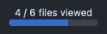

  
  <h1>GitHub Lines Viewed</h1>
  
🔠Enhancing the PR progress bar on GitHub to show <em><strong>lines</strong></em> viewed instead of files. ğŸ“

  

 
 

## Why?

Ever find yourself near the end of a review with one last file to look at,
only to find the last file has another 387 lines of changes you need to read through?

If you find GitHub's review progress bar to be misleading then this is the
browser addon for you! It changes the progress bar to be based on the number of lines
viewed, rather than the number of files.

You don't need to do anything differently, the progress bar will be replaced by the
extension, and you can enjoy a more helpful experience.

### Comparison

Colour Change at 100%:

Exclusions List:

## Features

- Replaces 'files viewed' with 'lines viewed'
- Progress bar colour to change based on its value, to clearly indicate a difference
  between anything < 100% and 100%
- Customisable file exclusion list to ignore machine-readable `.lock` files with thousands of changes
  - Option to insert common `.lock` files for most programming languages:
    - Python
    - JavaScript
    - Java
    - C/C++
    - PHP
    - Go
    - Rust
    - Dart
    - Ruby
    - Swift
    - R
    - Elixir
    - .NET

 
 
 
 
 

 

